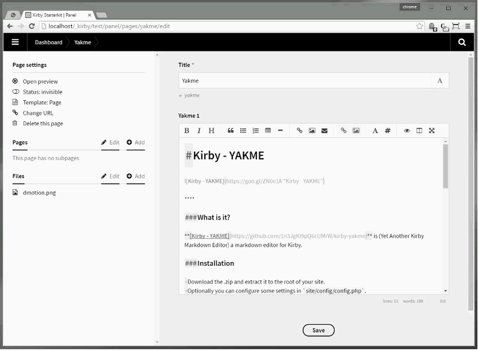
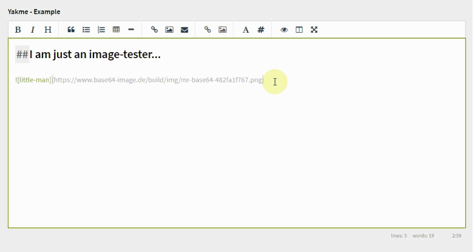
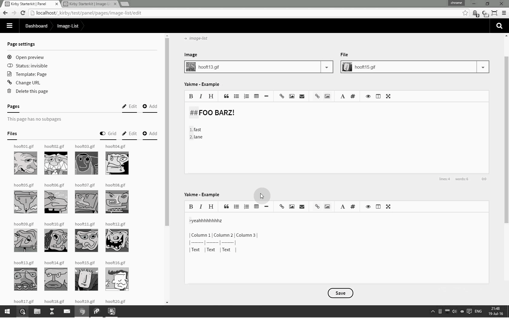
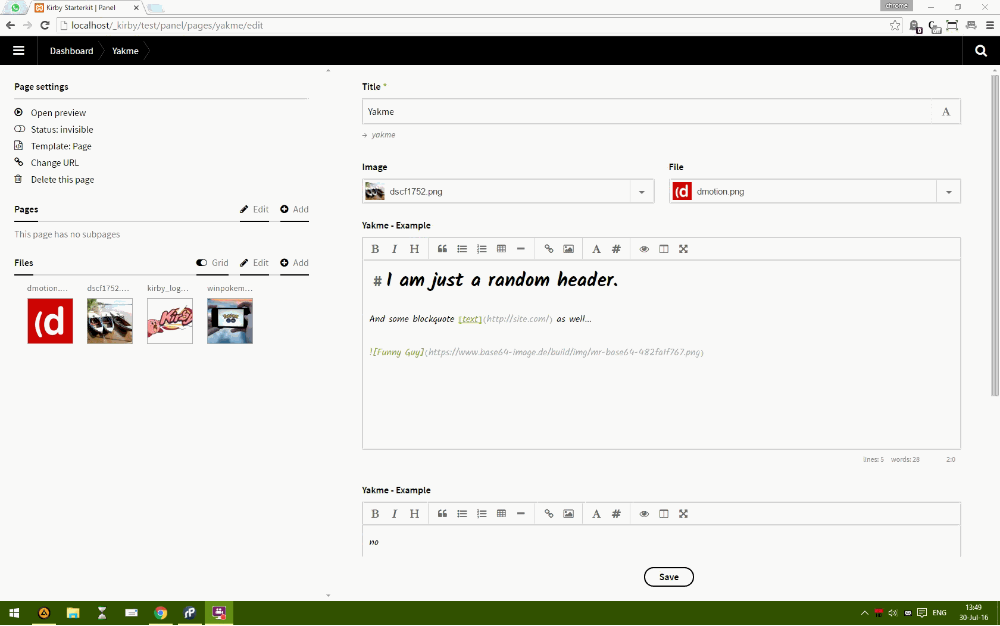
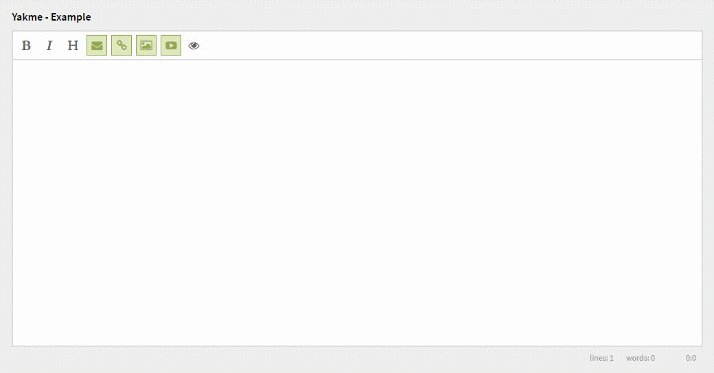

# [Kirby - YAKME](https://github.com/1n3JgKl9pQ6cUMrW/kirby-yakme)


****

#### Version 1.0.0 - 2016-07-13

- Initial Public Offering.

#### Version 1.1.5 - 2016-07-14

- Small adjustmens / fixes.
- Optional image-check for markdown-images.

#### Version 1.2.1 - 2016-07-25

- (Basic) support of image drag/drop from the assets-sidebar.
- Small adjustments / fixes.

#### Version 1.2.2 - 2016-07-26

- Kirby-tag insert fix (cursor position).
- Visual adjustments for the toolbar.

#### Version 1.2.5 - 2016-07-30

- Option to style the editor / preview.
- Fixes and tunes.

#### Version 1.2.7 - 2016-07-31

- Option to hide each individual button in the toolbar.
- Live preview of a YouTube video.
- Fixes and tunes.

#### Version 1.3.1 - 2016-08-01

- Option to show / hide each individual button in the toolbar.
- Typewriter-tag renamed to general font-tag.
- Minor fixes and tunes.

#### Version 1.4.5 - 2016-09-22

- Autosave (optional) of every YAKME-field.
- Number of keystrokes are shown in the status-area.
- Minor fixes and tunes.

#### Version 1.4.6 - 2016-11-07

- Error-fix when hiding the Kirby Mail Button;

```
  yakme_example_field:
    label: Yakme - Example
    type: yakme
    hide:
      - kirby-mail
```

****

### What is it?

**[Kirby - YAKME](https://github.com/1n3JgKl9pQ6cUMrW/kirby-yakme)** (Yet Another Kirby Markdown Editor) is a markdown editor for Kirby.

It uses the **excellent** Simple MDE (editor) from **https://simplemde.com/** as it's core-engine.

More info about Kirby can be found at **http://getkirby.com**

More info about this plug-in can be found at **https://forum.getkirby.com/t/kirby-yakme-yet-another-kirby-markdown-editor/4677/13?u=1n3jgkl9pq6cumrw**

### Installation

- Download the .zip and extract it to the root of your site.
- Optionally you can configure some settings in `site/config/config.php`.

### Usage

A sample blueprint is included, as an introduction for the basic set-up.

```
title: Page
pages: true
files: true
fields:

  title:
    label: Title
    type:  text

  yakme_example:
    label: Yakme - Example
    type:  yakme

    hide:
      - bold
      - italic
      - heading
      - quote
      - list
      - list-ul
      - list-ol
      - table
      - divider
      - link
      - image
      - kirby
      - kirby-mail
      - kirby-link
      - kirby-image
      - kirby-video
      - font
      - wysiwyg
      - preview
      - split
      - fullscreen

    show:
      - bold
      - italic
      - heading
      - quote
      - list
      - list-ul
      - list-ol
      - table
      - divider
      - link
      - image
      - kirby
      - kirby-mail
      - kirby-link
      - kirby-image
      - kirby-video
      - font
      - wysiwyg
      - preview
      - split
      - fullscreen
```

The fieldtype is ```yakme``` and you can hide / show any button; just check out the table below.

| **Option** | **Explain** |
| -------- | -------- |
| bold | Hide / show the bold / strong button |
| italic | Hide / show the italic / em button |
| heading | Hide / show the heading (H1, etc...) button |
| quote | Hide / show the blockquote button |
| list | Hide / show ALL list buttons |
| list-ul | Hide / show the ul-list button |
| list-ol | Hide / show the ol-list button |
| table | Hide / show the table button |
| divider | Hide / show the divider / hr button |
| link | Hide / show the link button |
| image | Hide / show the image button |
| kirby | Hide / show ALL kirby-only buttons (the green ones) |
| kirby-mail | Hide / show the kirby-mail button |
| kirby-link | Hide / show the kirby-link button |
| kirby-image | Hide / show the kirby-image button |
| kirby-video | Hide / show the kirby-video button |
| font | Hide / show the font (monospace / proportional) button |
| wysiwyg | Hide / show the WYSIWYG-button (experimental) |
| preview | Hide / show the preview button |
| split | Hide / show the splitscreen-button |
| fullscreen | Hide / show the fullscreen-button |

Remember; even when a button is hidden, you can access it's functionality by manually entering the markdown-code or pressing the shortcut (see later in this document) for it.

In order to avoid conflicts, when both `hide` and `show` are set, `show` will always win (see example at https://forum.getkirby.com/t/kirby-yakme-yet-another-kirby-markdown-editor/4677/58).

Also you can add some (general) preferences by setting them in ```config.php```. Finally you can toggle each individual field-preference with the `font` and `wysiwyg` buttons (which are saved per field).

****

Once set, the field can be rendered like this;

```
<?php
    echo $page->yakme_example()->kirbytext();
?>
```

****

The field acts like a normal textarea, but with some extra's;

1. Live preview toggle (**eye icon**).
2. Hide markdown codes (**hashtag icon**).
3. Side by side editing (**column icon**).
4. Fixed font option (**font icon**).
5. Full support of all markdown codes ( http://www.markitdown.net/markdown ).

The fixed font is helpfull when creating tables or entering codes.

Every instance of a YAKME-field can have individual preferences;

1. Fixed font or default font.
2. Toggle (WYSIWYG) markdown codes.

These settings are saved to the local device (`localstorage`).

****

If you want to make use of the `video` tag, please make sure you also added the `\site\tags\video\video.php` file to your project.

### Shortcuts

| **Shortcut** | **Action** |
| -------- | -------- |
| Ctrl-' | Blockquote |
| Ctrl-B | Bold |
| Ctrl-D | Delete line |
| Ctrl-E | Clear |
| Ctrl-H | Heading - |
| Ctrl-I | Italic |
| Ctrl-K | Link |
| Ctrl-L | Unordered List |
| Ctrl-P | Preview |
| Ctrl-Alt-C | Code |
| Ctrl-Alt-I | Image |
| Ctrl-Alt-L | Ordered List |
| Shift-Ctrl-H | Heading + |
| F9 | Sideview |
| F11 | Fullscreen |

> Mac users, please use `cmd` in stead of `ctrl`

### Config

By default, no `config` is needed. But you can set the styling / height of the YAKME-field and perform an image-check;

```
c::set('yakme_height', 0);
```

This will set an "auto-height" for every field; the more the content, the larger the field.

```
c::set('yakme_height', 480);
```

This will set a "fixed-height" for every field; the size is in pixels and when the content becomes to large, a scrollbar will appear.

The settings defaults to 320px - so that's used when no settings are available.

****

```
c::set('yakme_images', 0);
```

Markdown-images will not be checked for validity, when rendered in the live-preview.

```
c::set('yakme_images', 1);
```
A check will be performed when previewing markdown-images. When an images does not exist, a error-sign is showed.

**Please note, Kirby image-tags can not (yet) be validated.**

```
c::set('yakme_autosave', 1);
```
`Autosave` the text (while uploading / removing files) or not.

The text is saved in the browser-memory (not on the server or local storage) when autosaving is set to 1.

If you don't want to autosave the text, set this preference to 0.

**Please remember**; don't rely 100% on autosave - when you really leave the page (or reload the tab) the autosaved text is gone (sometimes Kirby itself will try to restore it, but again; don't count on it).

`Autosave` works fine when editing the textfield, uploading / removing files, etc... But when you have a lot of edited text, it's always better to press `save` yourself (and make backups).

****

```
c::set("panel.stylesheet", "assets/css/yakme.css");
```
This will load the (demo) css-file and style both the editor and previewmode.

###Known issues###

- Kirby-tags are supported, but not (yet) rendered in the live-preview.
- Images are only rendered in the live-preview with a full url.
- Turning of the markdown codes (hastag icon) do not show if text is selected / can hide the cursor.
- Some issues with the field in a modal (but it does work in a modal).
- Video-preview is only shown in preview-mode (not splitscreen-mode).

****



*Kirby YAKME - yet another kirby markdown editor.*



*Kirby YAKME - optional imagecheck enabled.*



*Kirby YAKME - asset drag and drop.*



*Kirby YAKME - styling.*



*Kirby YAKME - video.*